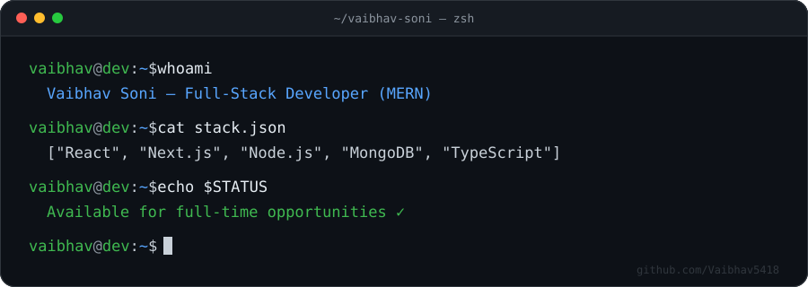

<div align="center">
  
</div>

<br>

### `$ cat profile.yaml`

```yaml
role: Full-Stack Developer (MERN)
looking_for: Full-time roles, open-source collabs, ambitious full-stack / UI-UX projects
can_help_with: Scaling apps, backend architecture, performance optimization
currently_learning: System design, advanced full-stack patterns, UI motion
ask_me_about: MERN stack, API design, project architecture
```

<br>

<div align="center">

### `$ open --contact`

<a href="https://www.linkedin.com/in/vaibhav-soni-77380926b/"></a>
<a href="mailto:sonivaibhav037@gmail.com"></a>
<a href="https://vaibhav-hustle-hub.vercel.app/"></a>

</div>

<br>

### `$ ls ./stack`

<div align="center">

**Languages**
<br>


<br><br>

**Frontend**
<br>


<br><br>

**Backend**
<br>


<br><br>

**Databases**
<br>


<br><br>

**Cloud & Tools**
<br>


</div>

<br>

<div align="center">

[](https://visitcount.itsvg.in)

`$ exit`

</div>
